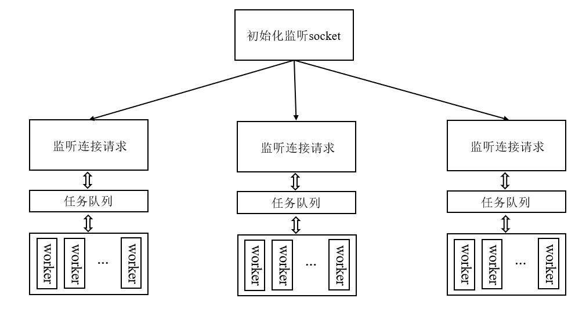

# libco学习笔记

## 用协程写一个echo_server

如果用多进程/多线程的网络服务器编程思路来写一个echo_server的话，那大概率是这种架构：



<center>Fig 1 多进程-多线程服务器架构图</center>

主进程先初始化一个全局的监听socket，随后fork出若干个进程。每个进程都会继承这个监听socket，并且工作在多线程的模式：主线程只负责接受新的连接，工作线程则负责接收和相应消息。主线程和工作线程之间通过任务队列进行通信。

如果要用协程来实现echo_server，但又不想丢失太多并发性的话，那就是保持程序多进程的结构（例如说将进程数设置成cpu核心数量），但是将多线程的部分改成用协程来实现：我们将接收连接的主线程和处理消息收发的工作线程改为协程，但是保留原来的生产者-消费者模式。数据收发协程将未初始化的文件描述符放进一个全局堆栈中，并将当前上下文切换到其它可运行的协程。连接接收协程在全局堆栈非空时，就会accept监听socket上的新连接，随后用这个新连接socket来初始化全局堆栈栈顶对应的文件描述符，最后pop栈顶，顺便切换到push这个文件描述符的协程。连接协程重复这个过程，直到全局堆栈清空。数据收发协程在当手头的文件描述符ready的时候，就会重复轮询该文件描述符，并echo，直到该连接断开，这时候数据收发线程又会将文件描述符push进全局堆栈，然后切换到其它可运行的协程。

## libco的一些关键api

+ `co_enable_hook_sys()`：如果我们希望将某个函数作为协程的运行逻辑，那么需要将这个调用置于函数的开始。
+ `int co_create(stCoRoutine_t **co, const stCoRoutineAttr_t *attr, void *(*routine)(void *), void *arg)`：第一个参数是协程对象指针的地址，若调用成功返回那么`co`参数所指向的指针将指向一个初始化的协程对象。`attr`是协程属性对象指针，如果用默认属性的话可以设为`NULL`。`routine`是一个函数指针——指向协程的运行逻辑，`arg`是`routine`的入参。（其实这个创建协程对象的调用和`pthread_create`入参含义类似）
+ `co_resume(stCoRoutine_t *co)`：开始/恢复某个协程的运行。
+ `void co_eventloop(stCoEpoll_t *ctx, pfn_co_eventloop_t pfn, void *arg)`：这个方法一般在主线程中创建完并运行了所有协程之后调用，一般以`co_eventloop(co_get_epoll_ct(), 0, 0)`形式调用。
+ `co_yield_ct()`：这个方法可以脱离当前协程的上下文，让底层运行的eventloop来决定下一个运行的协程。

## 连接接收协程、数据收发协程

数据收发协程：

```apache
struct task_t
{
    stCoRoutine_t *co;  
    int fd;
};

static stack<task_t*> g_readwrite;    // 这个堆栈用于通知连接接收协程去接收新的连接

static void *readwrite_routine(void *arg)
{
    co_enable_hook_sys();    // 声明这个函数可以作为协程逻辑
  
    task_t *co = (task_t*)arg;    // 当前协程与所负责的文件描述符
    char buf[1024 * 16];    // 接收缓冲
    while (1)
    {
        if (co->fd == -1)
        {    // 当前没有连接要处理，通知连接协程
            g_readwrite.push(co);
            co_yield_ct();    // 切到其它可运行的协程
            continue;    // 下一次回来之后再判断当前文件描述符是否指向新的连接
        }
        int fd = co->fd;
        co->fd = -1;
        // 循环读取新连接上的消息，直到对方断开
        while (1)
        {  
            struct pollfd pf = {0};
            pf.fd = fd;
            pf.events = (POLLIN | POLLERR | POLLHUP);
            co_poll(co_get_epoll_ct(), &pf, 1, 1000);    // 协程版本的poll
  
            int ret = read(fd, buf, sizeof(buf));
            if (ret > 0)
            {
                ret = write(fd, buf, ret);
            }
            if (ret > 0 || (ret == -1 && EAGAIN == errno))
            {  
                continue;
            }
            close(fd);
            break;
        }
    }
     return 0; 
}
```

连接接收协程：

```apache
static void *accept_routine(void*)
{
    co_enable_hook_sys();
  
    while (1)
    {
        if (g_readwrite.empty())
        {    // 如果g_readwrite是空的，那么自旋等待
            struct pollfd pf = {0};
            pf.fd = -1;
            poll(&pf, 1, 1000);    // sleep 1s
            continue;
        }
        // 有数据收发线程空闲了，尝试接收新连接
        struct sockaddr_in addr;
        memset(&addr, 0, sizeof(addr));  
        socklen_t len = sizeof(addr);

        int fd = co_accept(g_listen_fd, (struct sockaddr *)&addr, &len);
        if (fd < 0)
        {    // 没有新连接的话，那就用当前进程的epoll亲自去监听g_listen_fd
            struct pollfd pf = {0};
            pf.fd = g_listen_fd;
            pf.events = (POLLIN | POLLERR | POLLHUP);  
            co_poll(co_get_epoll_ct(), &pf, 1, 1000);
            continue;
        }
        if (g_readwrite.empty())
        {
            // 在通知其他协程之前再次判断是否还有协程在等待
            close(fd);
            continue;
        } 
        SetNonBlock(fd);
        task_t *co = g_readwrite.top();
        co->fd = fd;
        g_readwrite.pop();
        co_resume(co->co);
    }
    return 0;  
}
```

主main函数：

```apache
int main(int argc, char *argv)
{
    // read the cmd line params...
    g_listen_fd = CreateTcpSocket(port, ip, true);
    listen(g_listen_fd, 1024);
    if (g_listen_fd == -1)
    {
        printf("Port %d in use\n", port);
        exit(-1);
    }
  
     setNonBlock(g_listen_fd);

     for (int k = 0; k < n_process; ++k)
    {
        pid_t pid = fork();
        if (pid > 0)
        {
            continue;
        }
        else if (pid < 0)
        {
            break;
        }
        for (int i = 0; i < cnt; ++i)
        {
            task_t *task = (task_t*)calloc(1, sizeof(task_t));
            task->fd = -1;
            co_create(&(task->co), NULL, readwrite_routine, task);
            co_resume(task->co);   
        }
        stCoRotinue_t *accept_co = NULL;
        co_create(&accept_co, NULL, accept_routine, 0);
        co_resume(accept_co);

        co_eventloop(co_get_epoll_ct(), 0, 0);    // 启动无线循环
  
        exit(0); 
    }  
     return 0;
}
```
